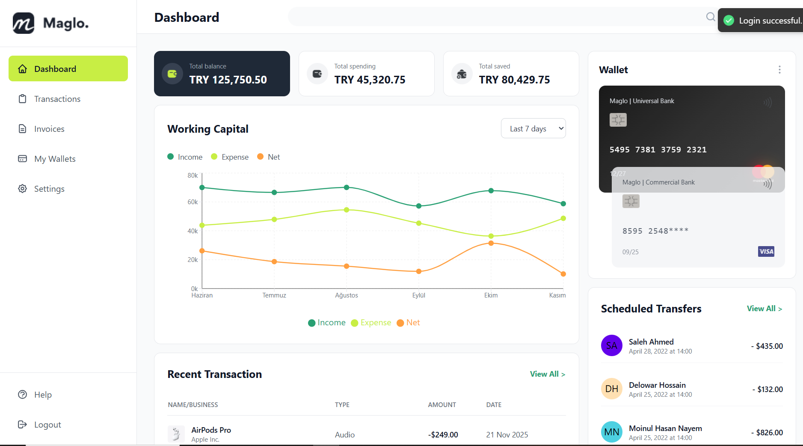
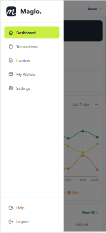

# 💰 Maglo - Finansal Takip Platformu

Modern ve kullanıcı dostu finansal dashboard uygulaması. Gelir-gider takibi, cüzdan yönetimi ve finansal analizlerinizi tek bir platformda yönetin.

---

## 📸 Ekran Görüntüleri

### 🏠 Dashboard - Desktop Görünümü



### 🔐 Giriş Ekranı


### 📝 Kayıt Ekranı


### 📱 Responsive Mobil Görünüm

<div style="display: flex; gap: 10px;">
  
</div>

---

## ✨ Özellikler

### 🎯 Temel Özellikler

- 📊 **Finansal Dashboard**: Gelir-gider takibi, toplam bakiye ve tasarruf gösterimi
- 💳 **Kredi Kartı Yönetimi**: Görsel kart gösterimi, kart detayları ve çoklu kart desteği
- 📈 **İnteraktif Grafikler**: Working Capital çizgi grafikleri (Recharts)
- 📋 **İşlem Takibi**: Son işlemler ve planlanmış transferler
- 🔔 **Bildirim Sistemi**: Gerçek zamanlı toast notifications
- 📱 **Tam Responsive**: Mobil, tablet ve desktop uyumlu
- 🔒 **Güvenli Authentication**: JWT tabanlı token sistemi
- 🛡️ **Error Handling**: Error Boundary ile kapsamlı hata yönetimi

### 🔥 İleri Seviye Özellikler

- ⚡ **Optimized Performance**: React Query ile cache yönetimi
- 🎨 **Modern UI/UX**: Tailwind CSS ile pixel-perfect tasarım
- 🔄 **Real-time Validation**: Form validasyonu ve görsel feedback
- 📊 **Data Visualization**: Tooltip, hover effects ve animasyonlar
- 🌐 **Çoklu Para Birimi**: TRY, USD, EUR desteği
- 📅 **Tarih Formatlama**: Uluslararası format desteği
- 🔐 **Protected Routes**: Otomatik yönlendirme ve auth guard
- 💾 **Persistent State**: LocalStorage ile oturum yönetimi

---

## 🚀 Kurulum ve Çalıştırma

### Gereksinimler

- Node.js 18+
- npm veya yarn

### Kurulum Adımları

```bash
# Projeyi klonlayın
git clone https://github.com/yourusername/maglo.git

# Proje dizinine gidin
cd maglo

# Bağımlılıkları yükleyin
npm install

# Geliştirme sunucusunu başlatın
npm run dev
```

Uygulama `http://localhost:5173` adresinde çalışacaktır.

### Production Build

```bash
# Production build oluşturun
npm run build

# Build'i önizleyin
npm run preview
```

---

## 🛠️ Teknolojiler

| Kategori               | Teknolojiler         | Açıklama                           |
| ---------------------- | -------------------- | ---------------------------------- |
| **Frontend Framework** | React 18             | Modern UI library                  |
| **Language**           | TypeScript 5.0       | Type-safe JavaScript               |
| **Build Tool**         | Vite                 | Lightning fast HMR                 |
| **Styling**            | Tailwind CSS 3.0     | Utility-first CSS framework        |
| **Routing**            | React Router v6      | Client-side routing                |
| **State Management**   | Zustand              | Lightweight state management       |
| **Data Fetching**      | TanStack React Query | Server state management            |
| **Form Management**    | React Hook Form      | Performant form handling           |
| **Validation**         | Zod                  | TypeScript-first schema validation |
| **Charts**             | Recharts             | Composable charting library        |
| **Notifications**      | React Hot Toast      | Toast notifications                |
| **HTTP Client**        | Axios                | Promise-based HTTP client          |
| **Date Formatting**    | date-fns             | Modern date utility library        |

---

## 📁 Proje Yapısı

```
maglo/
├── public/                    # Static assets
├── src/
│   ├── assets/               # Images, icons
│   │   └── images/
│   │       ├── auth/        # Authentication assets
│   │       └── dashboard/   # Dashboard assets
│   ├── components/          # React components
│   │   ├── forms/          # Form components
│   │   │   ├── SignInForm/
│   │   │   └── SignUpForm/
│   │   ├── layout/         # Layout components
│   │   │   ├── Header/
│   │   │   ├── Sidebar/
│   │   │   └── ProtectedRoute/
│   │   └── ui/             # Reusable UI components
│   │       ├── Button/
│   │       ├── Input/
│   │       ├── Logo/
│   │       └── ErrorBoundary/
│   ├── lib/                # Libraries and utilities
│   │   ├── api/           # API client and endpoints
│   │   │   ├── client.ts
│   │   │   ├── auth.ts
│   │   │   └── dashboard.ts
│   │   ├── utils/         # Helper functions
│   │   │   ├── formatCurrency.ts
│   │   │   └── formatDate.ts
│   │   └── validations/   # Zod schemas
│   │       └── authSchemas.ts
│   ├── pages/             # Page components
│   │   ├── Dashboard/
│   │   ├── SignIn/
│   │   └── SignUp/
│   ├── store/             # Zustand stores
│   │   └── authStore.ts
│   ├── types/             # TypeScript types
│   │   ├── auth.ts
│   │   └── dashboard.ts
│   ├── App.tsx            # Main app component
│   ├── main.tsx           # Entry point
│   └── index.css          # Global styles
├── README.md
├── package.json
├── tsconfig.json
├── tailwind.config.js
└── vite.config.ts
```

                   |

### 🎨 UI/UX Detayları

- **Animations**: Smooth transitions ve hover effects
- **Loading States**: Skeleton shimmer effects
- **Error States**: Toast notifications ve error boundary
- **Form Feedback**: Real-time validation, görsel hata gösterimi
- **Responsive Design**: Mobile-first approach
- **Dark Mode Cards**: Kontrast kartlar
- **Icons**: Modern ikon seti
- **Typography**: Okunabilir font hierarchy

### 📱 Responsive Tasarım

#### Desktop (1024px+)

- Full sidebar navigation
- 6-column grid layout
- Expanded search bar
- All features visible

#### Tablet (768px - 1023px)

- Collapsible sidebar
- 4-column grid layout
- Compressed navigation

#### Mobile (< 768px)

- Hamburger menu
- Single column layout
- Bottom navigation (opsiyonel)
- Touch-optimized buttons

---

## 🔧 Geliştirme

### Available Scripts

```bash
# Development server with hot reload
npm run dev

# Build for production
npm run build

# Preview production build
npm run preview

# Linting
npm run lint
```

### Environment Variables

API proxy ayarları `vite.config.ts` içinde yapılmıştır:

```typescript
server: {
  proxy: {
    '/api': {
      target: 'https://case.nodelabs.dev',
      changeOrigin: true,
      secure: true,
    }
  }
}
```

### Code Style

- ESLint + TypeScript rules
- Prettier formatting
- Modular component yapısı
- Clean code principles

---

## 🛡️ Error Handling

### Kapsamlı Hata Yönetimi

1. **Error Boundary**: Component render hatalarını yakalar
2. **Axios Interceptors**: API hata yönetimi ve 401 handling
3. **React Query**: Network hatalarını yönetir
4. **Form Validation**: Zod ile güçlü validasyon
5. **Toast Notifications**: Kullanıcıya anlamlı hata mesajları

### Error Boundary Özellikleri

- Fallback UI ile zarif hata gösterimi
- Development mode'da detaylı error stack
- "Try Again" ve "Go Home" aksiyonları
- Console logging

## 👨‍💻 Geliştirici

**Baran Boga**  
📅 Kasım 2025

---

## 🙏 Teşekkürler

Bu proje, modern React ekosisteminin en iyi pratiklerini göstermek için geliştirilmiştir.

---

<div align="center">
  <strong>⭐ Projeyi beğendiyseniz yıldız vermeyi unutmayın!</strong>
</div>
